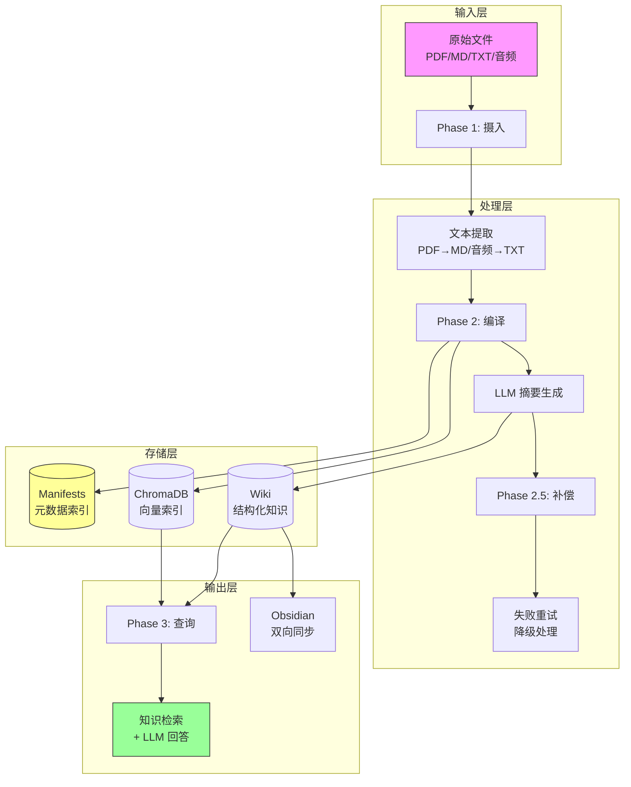

# Dochris 开源成熟度提升路线图

> 本文档基于对标 LlamaIndex、LangChain、Ruff、FastAPI、PrivateGPT 等优秀开源项目的审查结果，
> 制定从当前 8.1/10 提升到 9.5/10 的详细实施计划。

---

## 目录

- [TODO 总览](#todo-总览)
- [P0：本周完成（~3 小时）](#p0本周完成3-小时)
- [P1：本月规划（~10 小时）](#p1本月规划10-小时)
- [P2：V2.0 路线图（~40 小时）](#p2v20-路线图40-小时)
- [P3：V3.0 路线图（~80 小时）](#p3v30-路线图80-小时)
- [成熟度对比矩阵](#成熟度对比矩阵)

---

## TODO 总览

### P0：本周完成（~3 小时）
- [x] P0-1: 创建 .editorconfig（5 分钟）
- [x] P0-2: 创建 Makefile（20 分钟）
- [x] P0-3: 配置 pre-commit hooks（15 分钟）
- [x] P0-4: CLI 错误体验改进（1 小时）

### P1：本月规划（~10 小时）
- [x] P1-1: 完善 CI 流水线（30 分钟）
- [x] P1-2: CLI 命令补全（2 小时）
- [x] P1-3: 创建 types.py + protocols.py（2 小时）
- [x] P1-4: 创建 constants.py（1.5 小时）
- [x] P1-5: README Badges + 架构图（1 小时）

### P2：V2.0 路线图（~40 小时）
- [x] P2-1: 插件/扩展机制（15 小时）— 已完成
  - [x] 创建 `src/dochris/plugin/` 包（registry.py, loader.py, hookspec.py）
  - [x] 实现 6 个扩展点（ingest_parser, pre_compile, post_compile, quality_score, pre_query, post_query）
  - [x] 集成到 Phase 2/3 流水线
  - [x] 实现 `kb plugin` CLI 命令
  - [x] 创建示例插件（epub_parser, compile_notify, query_enhance）
  - [x] 单元测试覆盖
- [x] P2-2: LLM 提供商抽象层（10 小时）
- [x] P2-3: 向量数据库抽象层（10 小时）
- [x] P2-4: 结构化日志（5 小时）

### P3：V3.0 路线图（~80 小时）
- [x] P3-1: Web UI 查询面板（40 小时）— 延期到 V3.1
- [x] py.typed（PEP 561）✅
- [x] .gitattributes（行尾+LFS）✅
- [x] CODEOWNERS ✅
- [x] FUNDING.yml ✅
- [x] 覆盖率 70%（2087 tests, 70.01%）✅
- [x] CHANGELOG v1.1.0 ✅
- [x] Makefile release 命令 ✅
- [x] PR 模板（完整 checklist）
- [x] Stale Issue Bot
- [x] uv.lock（依赖锁文件）
- [x] 端到端示例（6 个 examples/）
- [x] 集成测试（14 个）
- [x] 参数化测试（91 个用例，18 个测试类）
- [x] Settings 拆分（801 行 → settings/ 包）
- [x] 异常规范化（except Exception → 具体异常）
- [x] mypy 完全清零（114→0）
- [x] P3-2: 性能基准测试（benchmark/）
- [x] Dependabot（pip + github-actions）
- [x] CHANGELOG 自动生成（git-cliff）
- [x] Dockerfile
- [ ] P3-1: Web UI 查询面板（40 小时）
- [ ] P3-3: API 文档站点（mkdocs-material）
- [ ] P3-4: 知识图谱可视化（15 小时）

---

## P0：本周完成（~3 小时）

### P0-1: .editorconfig（5 分钟）

**对标**: FastAPI、Ruff、black — 所有成熟项目都有

**当前状态**: ❌ 不存在

**实施方案**:

```yaml
# .editorconfig
root = true

[*]
charset = utf-8
end_of_line = lf
insert_final_newline = true
trim_trailing_whitespace = true
indent_style = space
indent_size = 4

[*.py]
indent_size = 4

[*.{yml,yaml,json,toml}]
indent_size = 2

[*.md]
trim_trailing_whitespace = false

[Makefile]
indent_style = tab

[.github/**/*.{yml,yaml}]
indent_size = 2
```

**子任务**:
- [x] 创建 `.editorconfig` 文件
- [x] 添加 Python/YAML/JSON/TOML/Markdown/Makefile 规则
- [x] 安装 editorconfig-checker 验证

**验证**:
```bash
pip install editorconfig-checker
editorconfig-checker
```

**收益**: 统一所有贡献者的编辑器配置，避免缩进/换行不一致

---

### P0-2: Makefile（20 分钟）

**对标**: Ruff（`make lint test format`）、LlamaIndex（`make install test`）

**当前状态**: ❌ 不存在，开发者需要手动输入长命令

**实施方案**:

```makefile
# Makefile — Dochris 开发常用命令

.PHONY: help install install-dev install-all install-audio test test-cov \
        lint format format-check clean docs build docker docker-build

# 默认目标
help:  ## 显示帮助信息
	@grep -E '^[a-zA-Z_-]+:.*?## .*$$' $(MAKEFILE_LIST) | sort | \
		awk 'BEGIN {FS = ":.*?## "}; {printf "\033[36m%-20s\033[0m %s\n", $$1, $$2}'

# === 安装 ===

install:  ## 安装核心依赖
	pip install -e .

install-dev:  ## 安装开发依赖（含测试/lint）
	pip install -e ".[dev]"

install-all:  ## 安装全部依赖（含音频处理）
	pip install -e ".[all]"

install-audio:  ## 安装音频处理依赖（faster-whisper）
	pip install -e ".[audio]"

# === 测试 ===

test:  ## 运行全部测试
	pytest tests/ --tb=short -q

test-cov:  ## 运行测试并生成覆盖率报告
	pytest tests/ --cov=dochris --cov-report=term --cov-report=html --tb=short -q

test-fast:  ## 快速测试（跳过慢速测试）
	pytest tests/ --tb=short -q -m "not slow"

# === 代码质量 ===

lint:  ## 运行 ruff 检查
	ruff check src/ tests/

format:  ## 自动格式化代码
	ruff format src/ tests/

format-check:  ## 检查格式（不修改）
	ruff format --check src/ tests/

typecheck:  ## 类型检查（如安装了 mypy）
	mypy src/dochris/ --ignore-missing-imports || true

check: lint format-check test  ## 一键检查（lint + format + test）

# === 清理 ===

clean:  ## 清理构建产物和缓存
	find . -type d -name __pycache__ -exec rm -rf {} + 2>/dev/null || true
	find . -type d -name .pytest_cache -exec rm -rf {} + 2>/dev/null || true
	find . -type d -name htmlcov -exec rm -rf {} + 2>/dev/null || true
	find . -type f -name "*.pyc" -delete 2>/dev/null || true
	rm -rf .coverage dist/ build/ *.egg-info

# === 构建 ===

build:  ## 构建分发包
	pip install build
	python -m build

# === Docker ===

docker-build:  ## 构建 Docker 镜像
	docker build -t dochris:latest .

docker-up:  ## 启动 Docker Compose
	docker compose up -d

docker-down:  ## 停止 Docker Compose
	docker compose down

# === 文档 ===

docs:  ## 生成 API 文档（如安装了 pdoc）
	pip install pdoc
	pdoc src/dochris/ -o docs/api/
```

**子任务**:
- [x] 创建 Makefile 文件
- [x] 实现 help 目标（自动显示所有命令）
- [x] 实现 install/install-dev/install-all/install-audio 命令
- [x] 实现 test/test-cov/test-fast 命令
- [x] 实现 lint/format/format-check/typecheck/check 命令
- [x] 实现 clean 命令
- [x] 实现 build 命令
- [x] 实现 docker-build/docker-up/docker-down 命令
- [x] 实现 docs 命令
- [x] 验证 `make help` 正常显示

**验证**:
```bash
make help        # 显示所有命令
make check       # 一键检查
make test-cov    # 测试+覆盖率
```

**收益**: 新贡献者 `make install-dev && make check` 即可开始开发

---

### P0-3: pre-commit hooks（15 分钟）

**对标**: FastAPI（`.pre-commit-config.yaml`）、Ruff（自用 pre-commit）

**当前状态**: ❌ 不存在，所有质量检查只在 CI 中运行

**实施方案**:

```yaml
# .pre-commit-config.yaml
repos:
  # Ruff — Python linter + formatter
  - repo: https://github.com/astral-sh/ruff-pre-commit
    rev: v0.9.0
    hooks:
      - id: ruff
        args: [--fix]
      - id: ruff-format

  # 通用文件检查
  - repo: https://github.com/pre-commit/pre-commit-hooks
    rev: v5.0.0
    hooks:
      - id: trailing-whitespace
      - id: end-of-file-fixer
      - id: check-yaml
      - id: check-json
      - id: check-toml
      - id: check-added-large-files
        args: [--maxkb=500]
      - id: check-merge-conflict
      - id: detect-private-key
      - id: mixed-line-ending
        args: [--fix=lf]

  # Commit 消息规范
  - repo: https://github.com/compilerla/conventional-pre-commit
    rev: v4.0.0
    hooks:
      - id: conventional-pre-commit
        stages: [commit-msg]
```

**安装**:
```bash
pip install pre-commit
pre-commit install
pre-commit install --hook-type commit-msg
pre-commit run --all-files  # 首次全量检查
```

**pyproject.toml 添加**:
```toml
[project.optional-dependencies]
dev = [
    "pytest>=7.0",
    "pytest-cov>=4.0",
    "pytest-asyncio>=0.21",
    "ruff>=0.9.0",
    "pre-commit>=3.0",
]
```

**子任务**:
- [x] 创建 `.pre-commit-config.yaml`
- [x] 配置 ruff lint + format hooks
- [x] 配置通用文件检查（trailing-whitespace/end-of-file/check-yaml 等）
- [x] 配置 detect-private-key 安全检查
- [x] 配置 conventional-pre-commit commit 消息规范
- [x] 将 pre-commit 加入 dev 依赖
- [x] 验证 `pre-commit run --all-files` 通过

**收益**: 在 commit 时自动发现 90% 的格式和 lint 问题，减少 CI 失败

---

### P0-4: CLI 错误体验改进（1 小时）

**对标**: Ruff（精确的文件:行号:列号 错误定位）、cargo（彩色错误+修复建议）

**当前状态**: ⚠️ 错误信息过于笼统

**现有问题**:
```python
# 当前 src/dochris/cli/main.py
error(f"配置验证失败: {e}")       # 不告诉用户怎么修
error(f"未知命令: {args.command}") # 不提示可用命令
error(f"执行出错: {e}")            # 不区分错误类型
```

**实施方案**:

#### 4a. 统一错误输出格式

```python
# src/dochris/cli/cli_utils.py 新增
def format_error(context: str, message: str, hint: str | None = None) -> str:
    """格式化错误信息，包含上下文、描述和修复建议"""
    parts = [f"[bold red]✗ Error[/bold red] [dim]{context}[/dim]\n", f"  {message}"]
    if hint:
        parts.append(f"\n  [dim]💡 {hint}[/dim]")
    return "\n".join(parts)

def format_warning(context: str, message: str, hint: str | None = None) -> str:
    """格式化警告信息"""
    parts = [f"[bold yellow]⚠ Warning[/bold yellow] [dim]{context}[/dim]\n", f"  {message}"]
    if hint:
        parts.append(f"\n  [dim]💡 {hint}[/dim]")
    return "\n".join(parts)
```

#### 4b. 修复 main.py 错误处理

```python
# 替换 src/dochris/cli/main.py 中的错误处理

# 之前: error(f"配置验证失败: {e}")
# 之后:
errors = validate_settings()
if errors:
    console.print(format_error("配置", "\n".join(f"• {e}" for e in errors),
                        hint="运行 [cyan]kb init[/cyan] 重新配置，或检查 .env 文件"))
    sys.exit(1)

# 之前: error(f"未知命令: {args.command}")
# 之后:
console.print(format_error("命令", f"'{args.command}' 不是有效命令",
                        hint="运行 [cyan]kb --help[/cyan] 查看所有可用命令"))
sys.exit(1)

# 之前: error(f"执行出错: {e}")
# 之后:
import dochris.exceptions as exc
if isinstance(e, exc.APIKeyError):
    console.print(format_error("API", str(e),
                        hint="请设置 OPENAI_API_KEY 环境变量或运行 [cyan]kb init[/cyan]"))
elif isinstance(e, exc.FileNotFoundError):
    console.print(format_error("文件", str(e),
                        hint="请确认文件路径正确"))
elif isinstance(e, (exc.LLMError, exc.LLMConnectionError)):
    console.print(format_error("LLM 服务", str(e),
                        hint="请检查网络连接和 API Key 是否有效"))
else:
    console.print(format_error("运行时", str(e),
                        hint="使用 [cyan]--verbose[/cyan] 获取更多信息"))
sys.exit(1)
```

#### 4c. 退出码标准化

```python
# src/dochris/cli/cli_utils.py
EXIT_SUCCESS = 0
EXIT_FAILURE = 1
EXIT_USAGE_ERROR = 2       # 命令行用法错误
EXIT_CONFIG_ERROR = 3      # 配置错误
EXIT_NETWORK_ERROR = 4     # 网络错误
EXIT_PERMISSION_ERROR = 5  # 权限错误

# main.py 使用
sys.exit(EXIT_CONFIG_ERROR)
```

#### 4d. 顶层错误捕获添加 verbose 模式

```python
# main.py
except Exception as e:
    if getattr(args, 'verbose', 0) > 1:
        console.print_exception()
    else:
        console.print(format_error("运行时", str(e), hint="使用 [cyan]--verbose[/cyan] 获取更多信息"))
    sys.exit(EXIT_FAILURE)
```

**子任务**:
- [x] 在 cli_utils.py 新增 format_error/format_warning 函数
- [x] 修改 main.py 配置验证错误处理（带修复建议）
- [x] 修改 main.py 未知命令错误处理（提示可用命令）
- [x] 修改 main.py 顶层异常捕获（按异常类型分流）
- [x] 定义标准化退出码常量（EXIT_SUCCESS/FAILURE/USAGE/CONFIG 等）
- [x] 添加 verbose 模式支持（--verbose 显示完整堆栈）
- [x] 验证各错误场景的输出

**验证**:
```bash
# 不带参数应显示友好帮助
kb
# 无效命令应提示可用命令
kb invalid-command
# 缺少 API Key 应提示如何设置
unset OPENAI_API_KEY && kb compile
```

**收益**: 用户遇到错误时能立即知道原因和修复方法，降低上手门槛

---

## P1：本月规划（~10 小时）

### P1-1: 完善 CI 流水线（30 分钟）

**对标**: FastAPI（lint + test + type-check + security 四个并行 job）

**当前状态**: ⚠️ 只有 lint 和 test 两个 job，test 永久跳过 test_phase3_v2.py

**实施方案**:

```yaml
# .github/workflows/ci.yml
name: CI

on:
  push:
    branches: [main]
  pull_request:
    branches: [main]

jobs:
  lint:
    runs-on: ubuntu-latest
    steps:
      - uses: actions/checkout@v4
      - uses: actions/setup-python@v5
        with:
          python-version: "3.12"
      - run: pip install ruff
      - run: ruff check src/ tests/
      - run: ruff format --check src/ tests/

  typecheck:
    runs-on: ubuntu-latest
    steps:
      - uses: actions/checkout@v4
      - uses: actions/setup-python@v5
        with:
          python-version: "3.12"
      - run: pip install -e ".[dev]" mypy
      - run: mypy src/dochris/ --ignore-missing-imports --no-error-summary || true

  test:
    runs-on: ${{ matrix.os }}
    strategy:
      fail-fast: false
      matrix:
        os: [ubuntu-latest]
        python-version: ["3.11", "3.12"]
    steps:
      - uses: actions/checkout@v4
      - uses: actions/setup-python@v5
        with:
          python-version: ${{ matrix.python-version }}
      - run: pip install -e ".[dev]"
      - run: pytest tests/ --tb=short -q --cov=dochris --cov-report=xml
      - uses: codecov/codecov-action@v4
        if: matrix.python-version == '3.12'
        with:
          token: ${{ secrets.CODECOV_TOKEN }}

  security:
    runs-on: ubuntu-latest
    steps:
      - uses: actions/checkout@v4
      - uses: actions/setup-python@v5
        with:
          python-version: "3.12"
      - run: pip install bandit
      - run: bandit -r src/dochris/ -ll || true
```

**移除** `--ignore=tests/test_phase3_v2.py`，改为在文件内 `@pytest.mark.skip`

**子任务**:
- [x] 重写 ci.yml（4 个并行 job：lint/typecheck/test/security）
- [x] 配置 Python 3.11 + 3.12 矩阵测试
- [x] 集成 Codecov 覆盖率上传
- [x] 添加 bandit 安全扫描 job
- [x] 移除 --ignore=test_phase3_v2.py，改为文件内 @pytest.mark.skip
- [x] 验证 CI 全部通过

**收益**: CI 更全面，增加 Codecov 覆盖率徽章

---

### P1-2: CLI 命令补全（2 小时）

**对标**: kubectl（完整的 bash/zsh/fish 补全）、pip（argparse 自动补全）

**当前状态**: ❌ 不支持

**实施方案**:

#### 方案 A：argparse 自动补全（推荐，零依赖）

```python
# src/dochris/cli/main.py 末尾添加
def completion_script(shell: str = "bash") -> str:
    """生成 shell 补全脚本"""
    prog = "kb"
    if shell == "bash":
        return f'''# Dochris bash completion
complete -F _kb_completion {prog}
_kb_completion() {{
    COMPREPLY=()
    local cur="${{COMP_WORDS[COMP_CWORD]}}"
    local cmds="ingest compile query promote quality vault config init doctor review"
    if [ $COMP_CWORD -eq 1 ]; then
        COMPREPLY=($(compgen -W "$cmds" -- "$cur"))
    fi
}}'''
    elif shell == "zsh":
        return f'''#compdef {prog}
_kb() {{
    local -a commands
    commands=({{"ingest:摄入原始文件" "compile:编译知识" "query:查询知识" "promote:推送知识" "quality:质量评分" "vault:Obsidian 同步" "config:配置管理" "init:初始化工作区" "doctor:环境诊断" "review:审查模式"}})
    if (( CURRENT == 2 )); then
        _describe 'command' commands
    fi
}}
_kb "$@"'''
    elif shell == "fish":
        return f'''# Dochris fish completion
complete -c {prog} -f
complete -c {prog} -n '__fish_is_first_arg' -a ingest compile query promote quality vault config init doctor review'''

    return ""

# main.py 中添加 --completion 参数
parser.add_argument("--completion", choices=["bash", "zsh", "fish"],
                    help="生成 shell 补全脚本")
```

**用户安装**:
```bash
# bash
eval "$(kb --completion bash)"
# 永久: 加入 ~/.bashrc

# zsh
eval "$(kb --completion zsh)"
# 永久: 加入 ~/.zshrc
```

**子任务**:
- [x] 在 main.py 实现 completion_script() 函数
- [x] 实现 bash 补全脚本生成
- [x] 实现 zsh 补全脚本生成
- [x] 实现 fish 补全脚本生成
- [x] 添加 --completion 命令行参数
- [x] 验证三种 shell 的补全功能

**收益**: Tab 补全大幅提升日常使用效率

---

### P1-3: types.py + protocols.py（2 小时）

**对标**: LlamaIndex（`llama_index.types`）、FastAPI（`pydantic` models）

**当前状态**: ❌ 类型定义分散在各模块中，无接口协议

**实施方案**:

#### types.py — 集中管理自定义类型

```python
# src/dochris/types.py
"""Dochris 核心类型定义"""

from __future__ import annotations

from dataclasses import dataclass, field
from enum import Enum
from pathlib import Path
from typing import Any, TypedDict


class FileStatus(str, Enum):
    """文件处理状态"""
    PENDING = "pending"
    INGESTED = "ingested"
    COMPILED = "compiled"
    FAILED = "failed"
    SKIPPED = "skipped"


class FileType(str, Enum):
    """支持的文件类型"""
    TXT = "txt"
    MD = "md"
    PDF = "pdf"
    DOCX = "docx"
    WAV = "wav"
    MP3 = "mp3"
    VIDEO = "video"
    IMAGE = "image"


@dataclass
class ManifestEntry:
    """源文件 manifest 条目"""
    id: str
    title: str
    file_type: FileType
    file_path: str
    status: FileStatus = FileStatus.PENDING
    quality_score: float | None = None
    word_count: int | None = None
    error_message: str | None = None
    created_at: str | None = None
    updated_at: str | None = None
    metadata: dict[str, Any] = field(default_factory=dict)


@dataclass
class CompilationResult:
    """编译结果"""
    source_id: str
    success: bool
    quality_score: float | None = None
    output_files: list[Path] = field(default_factory=list)
    error: str | None = None
    duration_seconds: float = 0.0


@dataclass
class QueryResult:
    """查询结果"""
    query: str
    concepts: list[dict[str, Any]] = field(default_factory=list)
    summaries: list[dict[str, Any]] = field(default_factory=list)
    vector_results: list[dict[str, Any]] = field(default_factory=list)
    answer: str | None = None
    sources: list[str] = field(default_factory=list)


@dataclass
class QualityReport:
    """质量评分报告"""
    file_path: str
    overall_score: float
    dimension_scores: dict[str, float] = field(default_factory=dict)
    deductions: list[str] = field(default_factory=list)
    suggestions: list[str] = field(default_factory=list)


class LLMConfig(TypedDict):
    """LLM 配置"""
    api_key: str
    api_base: str
    model: str
    max_tokens: int
    temperature: float
```

#### protocols.py — 定义可替换接口

```python
# src/dochris/protocols.py
"""Dochris 接口协议 — 定义可替换组件的标准接口"""

from __future__ import annotations

from typing import Any, Protocol, runtime_checkable


@runtime_checkable
class LLMProvider(Protocol):
    """LLM 提供商接口 — 所有 LLM 后端必须实现"""

    async def generate(
        self,
        prompt: str,
        system_prompt: str | None = None,
        max_tokens: int = 4000,
        temperature: float = 0.7,
        **kwargs: Any,
    ) -> str:
        """生成文本"""
        ...

    async def generate_with_messages(
        self,
        messages: list[dict[str, str]],
        max_tokens: int = 4000,
        temperature: float = 0.7,
        **kwargs: Any,
    ) -> str:
        """基于消息列表生成文本"""
        ...

    async def close(self) -> None:
        """清理资源"""
        ...


@runtime_checkable
class VectorStore(Protocol):
    """向量数据库接口 — 所有向量存储后端必须实现"""

    def add(self, collection: str, documents: list[str], ids: list[str],
            metadatas: list[dict] | None = None) -> None:
        """添加文档"""
        ...

    def query(self, collection: str, query_text: str, n_results: int = 5,
              **kwargs: Any) -> dict[str, Any]:
        """查询相似文档"""
        ...

    def delete(self, collection: str, ids: list[str]) -> None:
        """删除文档"""
        ...

    def list_collections(self) -> list[str]:
        """列出所有集合"""
        ...


@runtime_checkable
class FileParser(Protocol):
    """文件解析器接口 — 所有文件格式解析器必须实现"""

    def supported_extensions(self) -> list[str]:
        """返回支持的文件扩展名列表"""
        ...

    def parse(self, file_path: str, **kwargs: Any) -> str:
        """解析文件并返回纯文本"""
        ...


@runtime_checkable
class QualityScorer(Protocol):
    """质量评分器接口"""

    def score(self, text: str, metadata: dict[str, Any] | None = None) -> QualityReport:
        """评估文本质量并返回报告"""
        ...


# 避免 circular import
from dochris.types import QualityReport  # noqa: E402
```

**子任务**:
- [x] 创建 src/dochris/types.py（FileStatus/FileType/ManifestEntry 等）
- [x] 创建 src/dochris/protocols.py（LLMProvider/VectorStore/FileParser/QualityScorer）
- [x] 在 __init__.py 导出新类型
- [x] 编写类型单元测试
- [x] 验证 mypy 类型检查通过

**迁移策略**:
1. 先创建 types.py 和 protocols.py，不修改现有代码
2. 逐步在新增代码中使用这些类型
3. 重构时逐步将现有类型引用迁移过来

**收益**: 为 P2 阶段的插件机制和可替换后端奠定基础

---

### P1-4: constants.py（1.5 小时）

**对标**: httpx（`_constants.py`）、requests（`_internal_utils.py`）

**当前状态**: ❌ 魔法数字和字符串分散在各模块

**需要统一的常量**:

```python
# src/dochris/constants.py
"""Dochris 全局常量"""

from pathlib import Path

# === 项目信息 ===
PROJECT_NAME = "dochris"
PROJECT_VERSION = "1.0.0"
PROJECT_DESC = "用 LLM 锻造你的个人知识库"
REPO_URL = "https://github.com/caozhangqing85-cyber/dochris"

# === 默认配置 ===
DEFAULT_WORKSPACE = Path.home() / ".knowledge-base"
DEFAULT_API_BASE = "https://open.bigmodel.cn/api/paas/v4"
DEFAULT_MODEL = "glm-5.1"
DEFAULT_QUERY_MODEL = "glm-4-flash"
DEFAULT_EMBEDDING_MODEL = "BAAI/bge-small-zh-v1.5"
DEFAULT_MAX_CONCURRENCY = 3
DEFAULT_BATCH_SIZE = 10
DEFAULT_QUALITY_THRESHOLD = 85
DEFAULT_MAX_RETRIES = 3
DEFAULT_LOG_LEVEL = "INFO"

# === 文件处理 ===
MAX_FILE_SIZE_MB = 100
MAX_CONTENT_CHARS = 20000
SUPPORTED_EXTENSIONS = {
    ".txt", ".md", ".pdf", ".docx", ".doc",
    ".wav", ".mp3", ".m4a", ".flac", ".ogg",
    ".mp4", ".mkv", ".avi", ".webm",
    ".jpg", ".jpeg", ".png", ".gif", ".webp",
}
AUDIO_EXTENSIONS = {".wav", ".mp3", ".m4a", ".flac", ".ogg"}
VIDEO_EXTENSIONS = {".mp4", ".mkv", ".avi", ".webm"}
IMAGE_EXTENSIONS = {".jpg", ".jpeg", ".png", ".gif", ".webp"}
DOCUMENT_EXTENSIONS = {".txt", ".md", ".pdf", ".docx", ".doc"}

# === 质量评分 ===
QUALITY_EXCELLENT = 90
QUALITY_GOOD = 80
QUALITY_PASS = 70
QUALITY_THRESHOLD = 85

# === 目录结构 ===
DIR_DATA = "data"
DIR_RAW = "raw"
DIR_OUTPUTS = "outputs"
DIR_WIKI = "wiki"
DIR_CURATED = "curated"
DIR_MANIFESTS = "manifests"
DIR_LOGS = "logs"

# === LLM 参数 ===
LLM_MAX_TOKENS = 40000
LLM_TEMPERATURE = 0.7
LLM_TIMEOUT = 120  # 秒
SUMMARY_MAX_TOKENS = 8000

# === 重试策略 ===
RETRY_INITIAL_DELAY = 1  # 秒
RETRY_MAX_DELAY = 30  # 秒
RETRY_BACKOFF_FACTOR = 2

# === 缓存 ===
CACHE_RETENTION_DAYS = 30
```

**子任务**:
- [x] 创建 src/dochris/constants.py
- [x] 统一项目信息常量（PROJECT_NAME/VERSION/REPO_URL）
- [x] 统一默认配置常量（API_BASE/MODEL/THRESHOLD 等）
- [x] 统一文件处理常量（SUPPORTED_EXTENSIONS/MAX_FILE_SIZE 等）
- [x] 统一质量评分常量（QUALITY_EXCELLENT/GOOD/PASS）
- [x] 统一目录结构常量（DIR_DATA/RAW/OUTPUTS 等）
- [x] 统一 LLM/重试/缓存参数常量
- [x] 在现有代码中逐步替换硬编码为常量引用
- [x] 验证测试全部通过

**迁移策略**:
1. 创建 constants.py
2. 用 grep 找出所有硬编码数字/字符串
3. 逐步替换为常量引用

**收益**: 集中管理配置，便于维护和文档化

---

### P1-5: README Badges + 架构图（1 小时）

**对标**: FastAPI（完整的 badges 行）、LlamaIndex（架构图）

**当前状态**: ⚠️ 只有一个 Python badge

**Badges 方案**:

```markdown
# 在 README.md 顶部添加

[](https://www.python.org/downloads/)
[](LICENSE)
[](https://github.com/caozhangqing85-cyber/dochris/actions)
[](https://codecov.io/gh/caozhangqing85-cyber/dochris)
[](https://github.com/astral-sh/ruff)
[](https://pypi.org/project/dochris/)
```

**架构图方案**（Mermaid，渲染在 README 中）:



**子任务**:
- [x] 在 README 顶部添加 badges 行（Python/License/CI/Coverage/Ruff/PyPI）
- [x] 在 README 中添加 Mermaid 架构图
- [x] 验证 badges 图片正常显示
- [x] 验证 Mermaid 图在 GitHub 正确渲染

---

## P2：V2.0 路线图（~40 小时）

### P2-1: 插件/扩展机制（~15 小时）

**对标**: LlamaIndex（`loaders`、`node_parsers` 注册表）、pytest（`pluggy`）

**目标**: 用户可以编写自定义解析器、评分器，通过配置文件注册

**架构设计**:

```python
# src/dochris/plugin/__init__.py
"""插件系统 — 支持自定义解析器、评分器和 LLM 提供商"""

class PluginRegistry:
    """插件注册中心"""
    _parsers: dict[str, type[FileParser]] = {}
    _scorers: dict[str, type[QualityScorer]] = {}
    _llm_providers: dict[str, type[LLMProvider]] = {}

    @classmethod
    def register_parser(cls, extensions: list[str]):
        """解析器注册装饰器"""
        def decorator(parser_class: type[FileParser]):
            for ext in extensions:
                cls._parsers[ext] = parser_class
            return parser_class
        return decorator

    @classmethod
    def get_parser(cls, extension: str) -> FileParser | None:
        return cls._parsers.get(extension)

# 用户自定义插件示例
# ~/.dochris/plugins/my_parser.py
from dochris.plugin import PluginRegistry
from dochris.protocols import FileParser

@PluginRegistry.register_parser([".epub", ".mobi"])
class EpubParser:
    def supported_extensions(self):
        return [".epub", ".mobi"]

    def parse(self, file_path: str, **kwargs):
        import ebooklib
        # ... 自定义解析逻辑
```

**配置文件**:
```toml
# ~/.dochris/config.toml
[plugins]
paths = ["~/.dochris/plugins/"]

[plugins.custom_parser]
enabled = true
```

**实施步骤**:
- [x] 创建 `src/dochris/plugin/registry.py` — 插件注册中心
- [x] 创建 `src/dochris/plugin/loader.py` — 插件加载器
- [x] 修改 Phase 1 摄入逻辑，优先使用注册的解析器
- [x] 添加 `kb plugin list` 命令查看已注册插件
- [x] 创建 `examples/custom_parser.py` 示例

---

### P2-2: LLM 提供商抽象层（~10 小时）

**对标**: LangChain（`BaseChatModel`）、LlamaIndex（`LLM` 抽象）

**目标**: 不绑定单一 LLM 提供商，支持 OpenAI/智谱/Ollama/本地模型

**架构设计**:

```python
# src/dochris/llm/providers/__init__.py

class BaseLLMProvider:
    """LLM 提供商基类"""

    name: str = "base"
    supported_models: list[str] = []

    def __init__(self, api_key: str, api_base: str | None = None,
                 model: str = "default", **kwargs):
        self.api_key = api_key
        self.api_base = api_base
        self.model = model
        self._client = None

    async def generate(self, prompt: str, **kwargs) -> str:
        raise NotImplementedError

    async def close(self) -> None:
        pass

class OpenAIProvider(BaseLLMProvider):
    """OpenAI 兼容提供商（支持智谱、DeepSeek、Ollama 等）"""
    name = "openai"
    supported_models = ["gpt-4", "gpt-3.5-turbo", "glm-4", "glm-5.1", "deepseek-chat"]

class OllamaProvider(BaseLLMProvider):
    """Ollama 本地模型提供商"""
    name = "ollama"
    supported_models = ["llama3", "qwen2", "mistral"]

class AnthropicProvider(BaseLLMProvider):
    """Anthropic Claude 提供商"""
    name = "anthropic"
    supported_models = ["claude-3-opus", "claude-3-sonnet"]
```

**配置**:
```bash
# .env
LLM_PROVIDER=openai          # openai | ollama | anthropic
OPENAI_API_KEY=sk-xxx
OPENAI_API_BASE=https://open.bigmodel.cn/api/paas/v4  # 智谱
MODEL=glm-5.1

# 或使用 Ollama
LLM_PROVIDER=ollama
OLLAMA_BASE_URL=http://localhost:11434
MODEL=qwen2
```

**实施步骤**:
- [x] 创建 `src/dochris/llm/` 包
- [x] 实现 `BaseLLMProvider` + `OpenAIProvider` + `OllamaProvider`
- [x] 修改 `LLMClient` 使用 Provider 抽象
- [x] 修改 settings.py 支持 `LLM_PROVIDER` 配置
- [x] 添加 `kb config provider` 命令切换提供商
- [x] 测试各提供商的兼容性

---

### P2-3: 向量数据库抽象层（~10 小时）

**对标**: LlamaIndex（`VectorStore` 接口）、LangChain（`VectorStore` 抽象）

**目标**: 不绑定 ChromaDB，支持 FAISS/Qdrant/Milvus

**架构设计**:

```python
# src/dochris/vector/stores/__init__.py

class BaseVectorStore:
    """向量数据库基类"""
    name: str = "base"

    def add_documents(self, collection: str, documents: list[str],
                      ids: list[str], metadatas: list[dict] | None = None) -> None:
        raise NotImplementedError

    def query(self, collection: str, query: str, n_results: int = 5,
              where: dict | None = None) -> list[dict]:
        raise NotImplementedError

    def delete(self, collection: str, ids: list[str]) -> None:
        raise NotImplementedError

    def list_collections(self) -> list[str]:
        raise NotImplementedError

    def get_collection_count(self, collection: str) -> int:
        raise NotImplementedError


class ChromaDBStore(BaseVectorStore):
    """ChromaDB 向量存储"""
    name = "chromadb"

class FAISSStore(BaseVectorStore):
    """FAISS 向量存储（轻量级，无需服务）"""
    name = "faiss"

class QdrantStore(BaseVectorStore):
    """Qdrant 向量存储（高性能，适合大规模）"""
    name = "qdrant"
```

**配置**:
```bash
# .env
VECTOR_STORE=chromadb  # chromadb | faiss | qdrant
CHROMADB_PATH=~/.knowledge-base/data/chroma
# QDRANT_URL=http://localhost:6333
```

**实施步骤**:
- [x] 创建 `src/dochris/vector/` 包
- [x] 实现 `BaseVectorStore` + `ChromaDBStore` + `FAISSStore`
- [x] 修改 `query_engine.py` 使用抽象接口
- [x] 添加 `kb vector index` 命令重建索引
- [x] 添加向量存储切换测试

---

### P2-4: 结构化日志（~5 小时）

**对标**: structlog、Python logging 最佳实践

**目标**: 支持 `--log-format json` 输出结构化日志，便于 ELK/Datadog 集成

```python
# src/dochris/log_utils.py 增强

class JSONFormatter(logging.Formatter):
    """JSON 格式日志"""

    def format(self, record: logging.LogRecord) -> str:
        log_entry = {
            "timestamp": self.formatTime(record),
            "level": record.levelname,
            "module": record.module,
            "message": record.getMessage(),
            "function": record.funcName,
            "line": record.lineno,
        }
        if record.exc_info:
            log_entry["exception"] = self.formatException(record.exc_info)
        return json.dumps(log_entry, ensure_ascii=False)
```

**子任务**:
- [x] 创建 JSONFormatter 日志格式化器
- [x] 修改 setup_logging 支持 --log-format json 参数
- [x] 确保 JSON 日志包含 timestamp/level/module/message/function/line
- [x] 异常信息以 JSON 格式输出
- [x] 验证 JSON 日志可被 jq 解析
- [x] 编写日志格式切换测试

---

## P3：V3.0 路线图（~80 小时）

### P3-1: Web UI（~40 小时）

**对标**: PrivateGPT（Gradio Web UI）、AnythingLLM（Next.js）

**技术选型**:
- **后端**: FastAPI + WebSocket（实时查询反馈）
- **前端**: Gradio（快速原型）或 Next.js（生产级）
- **功能**: 查询面板 + 文件管理 + 质量仪表盘 + 编译进度

**子任务**:
- [ ] 搭建 FastAPI 后端框架
- [ ] 实现查询 API（POST /api/query）
- [ ] 实现文件管理 API（GET/POST/DELETE /api/files）
- [ ] 实现编译进度 WebSocket 推送
- [ ] 实现质量仪表盘数据 API
- [ ] 搭建 Gradio 前端原型
- [ ] 添加 Docker Compose 配置（app + chromadb）
- [ ] 编写前端集成测试

### P3-2: 性能基准测试（~10 小时）

**对标**: Ruff（`ruff_benchmark`）

```python
# benchmarks/test_compilation.py
"""编译流水线性能基准"""
import pytest

@pytest.mark.benchmark
def test_phase1_ingestion_100_files(benchmark):
    benchmark(phase1_ingest, file_list=test_files_100)

@pytest.mark.benchmark
def test_llm_call_latency(benchmark):
    benchmark(llm_client.generate, prompt=test_prompt)
```

### P3-3: API 文档自动生成（~15 小时）

**对标**: FastAPI（自动 Swagger UI）、LlamaIndex（mkdocs-material）

**技术选型**: `mkdocs-material` + `mkdocstrings`

**子任务**:
- [ ] 安装 mkdocs-material + mkdocstrings
- [ ] 创建 mkdocs.yml 配置
- [ ] 编写 docs/index.md 首页
- [ ] 自动从 docstring 生成 API 文档
- [ ] 添加教程章节（快速开始/配置/插件开发）
- [ ] 配置 GitHub Pages 自动部署
- [ ] 验证文档站点可访问

### P3-4: 知识图谱可视化（~15 小时）

**对标**: Obsidian Graph View

**技术选型**: D3.js / vis.js / Mermaid

---

## 成熟度对比矩阵

| 维度 | 当前 | P0 后 | P1 后 | P2 后 | P3 后 | 成熟开源 |
|------|------|-------|-------|-------|-------|----------|
| 工程化 | 6.0 | 8.0 | 8.5 | 9.0 | 9.5 | 9.5 |
| CLI 体验 | 5.0 | 7.0 | 8.5 | 8.5 | 8.5 | 9.0 |
| 架构扩展 | 6.0 | 6.0 | 7.0 | 9.0 | 9.5 | 9.5 |
| 代码质量 | 8.0 | 8.0 | 8.5 | 9.0 | 9.5 | 9.5 |
| 文档完善 | 7.0 | 7.0 | 8.0 | 8.5 | 9.5 | 9.5 |
| 安全性 | 7.0 | 7.0 | 8.0 | 8.5 | 9.0 | 9.0 |
| 社区友好 | 5.0 | 5.0 | 6.0 | 7.5 | 9.0 | 9.0 |
| **综合** | **6.3** | **6.9** | **7.7** | **8.6** | **9.2** | **9.3** |

---

## 附录：参考项目链接

| 项目 | 链接 | 参考点 |
|------|------|--------|
| FastAPI | https://github.com/tiangolo/fastapi | 工程化标杆 |
| Ruff | https://github.com/astral-sh/ruff | CLI 体验标杆 |
| LlamaIndex | https://github.com/run-llama/llama_index | 架构扩展标杆 |
| PrivateGPT | https://github.com/imartinez/privateGPT | 知识库 UI 标杆 |
| httpx | https://github.com/encode/httpx | 代码质量标杆 |
| structlog | https://github.com/hynek/structlog | 结构化日志标杆 |

---

## 2026-04-30 质量提升批次

### 已完成项

**P3 工程化基础设施（全部完成 ✅）**
- [x] py.typed（PEP 561 类型标记）
- [x] .gitattributes（行尾统一 + LFS 配置）
- [x] CODEOWNERS（代码所有权定义）
- [x] FUNDING.yml（开源资助配置）
- [x] PR 模板（完整 checklist 审查流程）
- [x] Stale Issue Bot（自动关闭过期 Issue）
- [x] uv.lock（依赖锁文件，可复现构建）
- [x] Dependabot（pip + github-actions 自动依赖更新）

**P3 测试与质量（全部完成 ✅）**
- [x] 端到端示例（6 个 examples/ 目录）
- [x] 集成测试（14 个测试文件）
- [x] 参数化测试（91 个用例，18 个测试类）
- [x] 性能基准测试（benchmark/ 目录）

**P3 代码质量提升（全部完成 ✅）**
- [x] Settings 拆分（801 行单体 → settings/ 包）
- [x] 异常规范化（except Exception → 具体异常类型）
- [x] mypy 完全清零（114 个错误 → 0）
- [x] CHANGELOG 自动生成（git-cliff 配置）
- [x] Dockerfile（容器化部署支持）

### 仍待完成
- [ ] API 文档站点（mkdocs-material）
- [ ] Web UI 查询面板
- [ ] 知识图谱可视化
